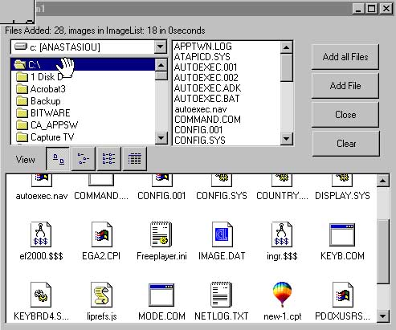



## Fill Listview With Files and their Icons

### Description

Shows how to add files to a listview with the associated icons

It is a litle tricky and I hope you vote for me

Needs Microsoft Scripting Runtime
 
### More Info
 
Needs Microsoft Scripting Runtime

             |
---                |---
**Submitted On**   |2000-06-16 19:20:54
**By**             |[JA](https://github.com/Planet-Source-Code/PSCIndex/blob/master/ByAuthor/ja.md)
**Level**          |Advanced
**User Rating**    |4.5 (18 globes from 4 users)
**Compatibility**  |VB 5\.0, VB 6\.0
**Category**       |[Custom Controls/ Forms/  Menus](https://github.com/Planet-Source-Code/PSCIndex/blob/master/ByCategory/custom-controls-forms-menus__1-4.md)
**World**          |[Visual Basic](https://github.com/Planet-Source-Code/PSCIndex/blob/master/ByWorld/visual-basic.md)
**Archive File**   |[CODE\_UPLOAD68406162000\.zip](https://github.com/Planet-Source-Code/ja-fill-listview-with-files-and-their-icons__1-8986/archive/master.zip)

